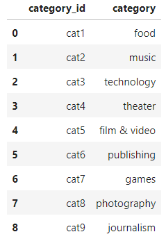
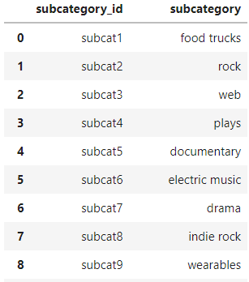
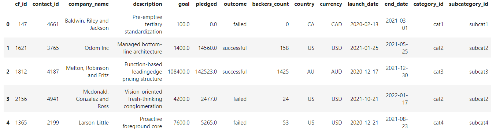
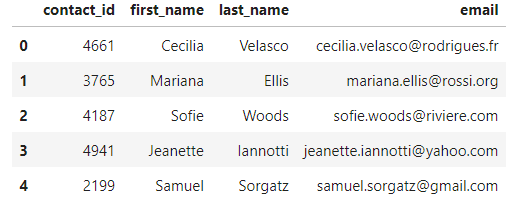
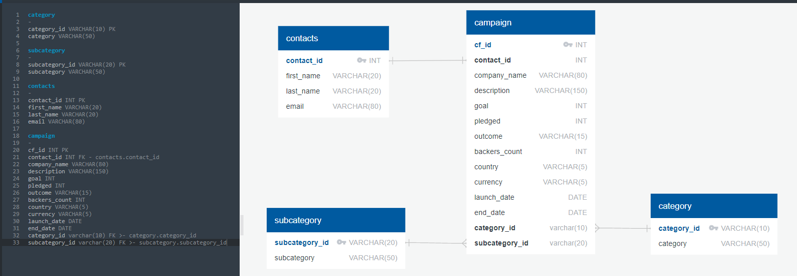

# Crowdfunding_ETL
## Project-2
This project was completed by Isabella Taylor and Phil Jaques.

The goal of this project was to create a database using crowdfunding data. The purpose of this project was to build an ETL pipeline using Python, Pandas, and regular expressions to extract and transform the data. 

## Extract
The original data sources extracted were: 
- [crowdfunding.xlsx](Resources/contacts.xlsx)
- [contacts.xlsx](Resources/contacts.xlsx)

## Transform
1. Transforming category and subcategory:
    - Split necessary columns
    - Created unique identifiers for category and subcategory columns
    - Created DataFrames and export to CSVs

 

2. Transforming the Campaign DataFrame:
    - Renamed necessary columns
    - Changed necessary data types
    - Merge DataFrame with the category and subcategory DataFrames
    - Unwanted columns were dropped and then exported into CSV files

3. Transforming the Contacts DataFrame:
    - Used regular expression to extract necessary data into new columns
    - Change data types
    - Reordered columns and exported into a CSV file

## Load
To create the final database we sketched an ERD using QuickDBD. We then created a [table schema](crowdfunding_db_schema.sql) for each CSV file to load into our crowdfunding_db database in Postgres, making sure that the tables were in the correct order to be able to handle the foreign keys.

* Tables:
    - category
    - subcategory
    - contacts
    - campaign

## Citations
Data for this dataset was generated by edX Boot Camps LLC, with the intention being for educational purposes.

These are the two files used for this project, [crowdfunding.xlsx](Resources/contacts.xlsx) and [contacts.xlsx](Resources/contacts.xlsx).